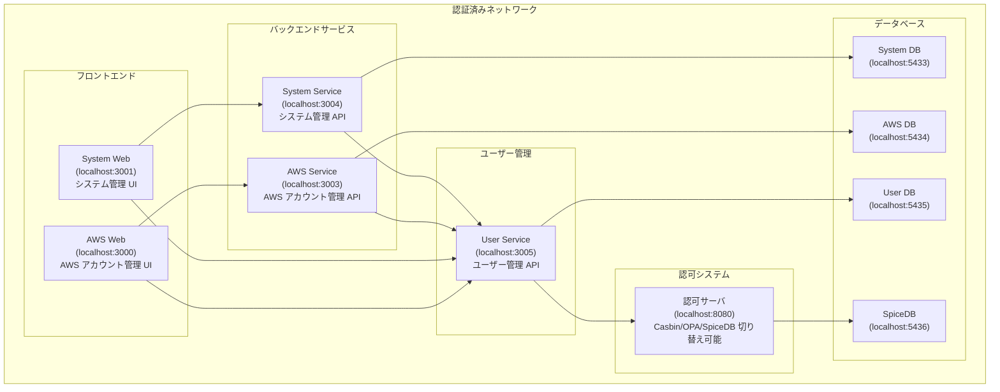
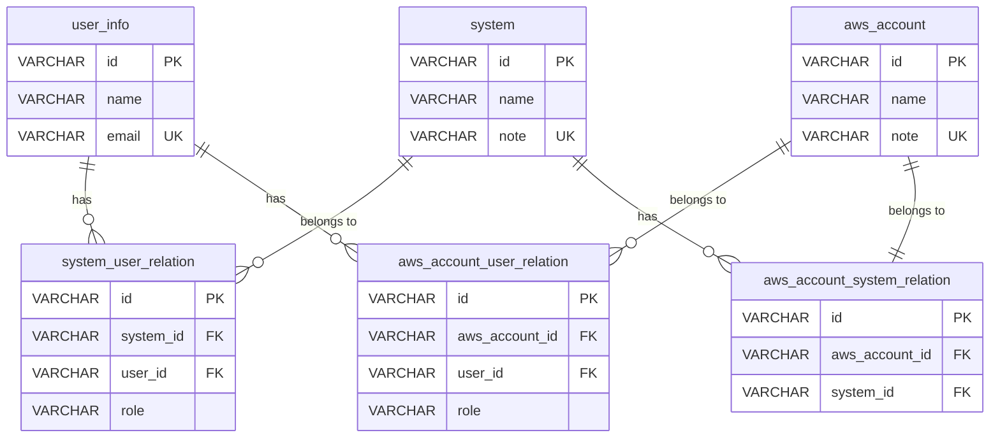

# sample-authorization-app

## プロジェクト概要

このリポジトリは、3 つの異なる認可システム（**Casbin**、**OPA**、**SpiceDB**）を比較検証するためのサンプルアプリケーションです。  
マイクロサービス環境での RBAC（Role-Based Access Control）の実装パターンを学習し、それぞれの特徴を理解することを目的としています。

## 認可サーバ比較表

| 認可システム | ポート | 特徴                 |
| ------------ | ------ | -------------------- |
| **Casbin**   | 8080   | RBAC                 |
| **OPA**      | 8081   | ポリシー言語(Rego)   |
| **SpiceDB**  | 8082   | Google Zanzibar 方式 |

## システム構成

### 前提条件

このシステム上では認可のみの検証を行います  
このネットワークに入っている状態で認証済みとします

### 構成図



### フロントエンド

- **AWS Web** (localhost:3000) - AWS アカウント管理 UI
- **System Web** (localhost:3001) - システム管理 UI

### バックエンドサービス

- **AWS Service** (localhost:3003) - AWS アカウント管理 API
- **System Service** (localhost:3004) - システム管理 API
- **User Service** (localhost:3005) - ユーザー管理 API

### データベース

- **PostgreSQL** - 各サービス専用 DB
  - System DB (localhost:5433)
  - AWS DB (localhost:5434)
  - User DB (localhost:5435)
  - SpiceDB (localhost:5436)

## 権限体系

### 認可条件

1. **Admin（管理者）**

   - フルアクセス権限を持つ
   - 全システム・全 AWS リソースにアクセス可能

2. **ユーザの所属**

   - ユーザは複数のシステムに所属可能
   - システムごとに異なる権限を持てる

3. **システム権限**

   - **オーナー**: システム全権（メンバー管理含む）
   - **マネージャー**: システムの修正、メンバー操作不可
   - **スタッフ**: 閲覧のみ

4. **AWS 権限**
   - AWS は単一のシステムに所属
   - **AWS 権限はシステム権限とは完全に独立**
   - システムでのロールに関係なく、AWS 権限は個別に付与される
   - オーナー・マネージャー・スタッフが存在
   - マネージャーはスタッフと同じ権限（閲覧のみ）

### 権限マトリックス

#### システム権限

| ロール       | 読取 | 更新 | 削除 | メンバー管理 |
| ------------ | ---- | ---- | ---- | ------------ |
| Admin        | ✓    | ✓    | ✓    | ✓            |
| オーナー     | ✓    | ✓    | ✓    | ✓            |
| マネージャー | ✓    | ✓    | ✓    | ✗            |
| スタッフ     | ✓    | ✗    | ✗    | ✗            |

#### AWS 権限（システム権限とは独立）

| ロール       | 読取 | 更新 | 削除 | 管理 |
| ------------ | ---- | ---- | ---- | ---- |
| Admin        | ✓    | ✓    | ✓    | ✓    |
| オーナー     | ✓    | ✓    | ✓    | ✓    |
| マネージャー | ✓    | ✗    | ✗    | ✗    |
| スタッフ     | ✓    | ✗    | ✗    | ✗    |

### 権限の独立性の例

**例**：ユーザー`saburo`の場合

- システム権限：`system1`の**マネージャー**、`system3`の**マネージャー**
- AWS 権限：`aws1`の**マネージャー**（`system1`に所属するが、システム権限とは独立）

この場合、`saburo`は：

- `system1`では更新・削除が可能（マネージャー権限）
- `aws1`では閲覧のみ可能（AWS マネージャーはスタッフと同じ権限）
- システムでの権限とは関係なく、AWS 権限は個別に設定される

## 検証

本プロジェクトでは、以下の観点で 3 つの認可システムを比較検証します。

### 認可の記述方法

#### Casbin

書く

#### OPA (Open Policy Agent)

書く

#### SpiceDB

書く

### 権限の更新方法

#### Casbin

書く

#### OPA

書く

#### SpiceDB

書く

### ついでに検証

フロントエンド、バックエンドからの認可情報による 403 制御が可能か

### 検証シナリオ

1. **基本的な RBAC**

   - ユーザーにロールを割り当て
   - ロールごとのリソースアクセス制御

2. **動的権限変更**

   - 運用中の権限追加/削除
   - 権限変更の反映時間計測

3. **複雑な権限関係**

   - 階層ロール（Admin > Owner > Manager > Staff）
   - リソース固有の権限設定

4. **パフォーマンス**
   - 大量ユーザー・リソースでの応答時間
   - メモリ使用量の比較

### 比較ポイント

- **学習コスト**: 設定の難易度・理解しやすさ
- **柔軟性**: 複雑な権限要件への対応力
- **パフォーマンス**: レスポンス時間・リソース使用量
- **運用性**: 権限管理の容易さ・デバッグのしやすさ
- **スケーラビリティ**: 大規模環境での性能

## 環境構築

### 前提条件

- Docker & Docker Compose
- .env.temp -> .env.local

### 起動方法

```bash
# 全サービス起動
docker compose watch

# サービス停止
docker compose down

# ファイルを更新する場合は
docker compose build
```

## 学習リソース

- [Casbin Documentation](https://casbin.org/)
- [OPA Documentation](https://www.openpolicyagent.org/)
- [SpiceDB Documentation](https://authzed.com/docs/)

## テーブル情報

### User Service（ユーザーサービス）

#### `user_info` テーブル

```sql
CREATE TABLE user_info (
    id VARCHAR(100) PRIMARY KEY,        -- ユーザーID
    name VARCHAR(100) NOT NULL,         -- ユーザー名
    email VARCHAR(100) UNIQUE NOT NULL  -- メールアドレス（ユニーク）
);
```

**初期データ：**

- `taro` - TARO(Admin)（管理者）
- `jiro` - Jiro(Owner)（システムオーナー）
- `saburo` - Saburo(Manager)（システムマネージャー）
- `hanako` - Hanako(Staff)（システムスタッフ）
- `alice` - Alice(AWS Only)（AWS 権限のみ）
- `bob` - Bob(No Permission)（権限なし）

### System Service（システムサービス）

#### `system` テーブル

```sql
CREATE TABLE system (
    id VARCHAR(100) PRIMARY KEY,      -- システムID
    name VARCHAR(100) NOT NULL,       -- システム名
    note VARCHAR(100) UNIQUE NOT NULL -- システムノート（ユニーク）
);
```

#### `system_user_relation` テーブル

```sql
CREATE TABLE system_user_relation (
    id VARCHAR(100) PRIMARY KEY,      -- リレーションID
    system_id VARCHAR(100) NOT NULL,  -- システムID
    user_id VARCHAR(100) NOT NULL,    -- ユーザーID
    role VARCHAR(50) NOT NULL         -- ロール（owner/manager/staff）
);
```

**初期データ：**

- `system1` (Development System), `system2` (Staging System), `system3` (Production System), `system4` (Testing System)

**権限マッピング：**

- `jiro`: system1 と system2 の**オーナー**
- `saburo`: system1 と system3 の**マネージャー**
- `hanako`: system2 と system3 の**スタッフ**
- `alice`: system4 の**スタッフ**

### AWS Service（AWS サービス）

#### `aws_account` テーブル

```sql
CREATE TABLE aws_account (
    id VARCHAR(100) PRIMARY KEY,      -- AWSアカウントID
    name VARCHAR(100) NOT NULL,       -- AWSアカウント名
    note VARCHAR(100) UNIQUE NOT NULL -- AWSアカウントノート（ユニーク）
);
```

#### `aws_account_system_relation` テーブル

```sql
CREATE TABLE aws_account_system_relation (
    id VARCHAR(100) PRIMARY KEY,       -- リレーションID
    aws_account_id VARCHAR(100) NOT NULL, -- AWSアカウントID
    system_id VARCHAR(100) NOT NULL    -- システムID
);
```

#### `aws_account_user_relation` テーブル

```sql
CREATE TABLE aws_account_user_relation (
    id VARCHAR(100) PRIMARY KEY,       -- リレーションID
    aws_account_id VARCHAR(100) NOT NULL, -- AWSアカウントID
    user_id VARCHAR(100) NOT NULL,     -- ユーザーID
    role VARCHAR(50) NOT NULL          -- ロール（owner/manager/staff）
);
```

**初期データ：**

- `aws1` (Development AWS) → system1 に所属
- `aws2` (Production AWS) → system2 に所属

**AWS 権限マッピング（システム権限とは独立）：**

- `aws1`: jiro（オーナー）、saburo（マネージャー）、hanako（スタッフ）
- `aws2`: alice（オーナー）

### データベース関係図



### 権限体系の特徴

1. **システム権限と AWS 権限は完全に独立**

   - システムでのロールに関係なく、AWS 権限は個別に付与
   - 例：`saburo`は system1 のマネージャーだが、aws1 ではマネージャー権限

2. **複数所属が可能**

   - ユーザーは複数のシステムに異なるロールで所属可能
   - 例：`jiro`は system1 と system2 のオーナー

3. **階層ロール**

   - Admin > Owner > Manager > Staff の階層構造

4. **AWS-システム関係**
   - 各 AWS アカウントは単一のシステムに所属
   - システム権限と AWS 権限は独立して管理
