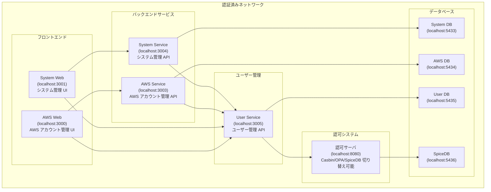

# sample-authorization-app

## プロジェクト概要

このリポジトリは、3 つの異なる認可システム（**Casbin**、**OPA**、**SpiceDB**）を比較検証するためのサンプルアプリケーションです。  
マイクロサービス環境での RBAC（Role-Based Access Control）の実装パターンを学習し、それぞれの特徴を理解することを目的としています。

## 認可サーバ比較表

| 認可システム | ポート | 特徴                 |
| ------------ | ------ | -------------------- |
| **Casbin**   | 8080   | シンプルな RBAC      |
| **OPA**      | 8081   | ポリシー言語(Rego)   |
| **SpiceDB**  | 8082   | Google Zanzibar 方式 |

## システム構成

### 前提条件

このシステム上では認可のみの検証を行います  
このネットワークに入っている状態で認証済みとします

### 構成図



### フロントエンド

- **AWS Web** (localhost:3000) - AWS アカウント管理 UI
- **System Web** (localhost:3001) - システム管理 UI

### バックエンドサービス

- **AWS Service** (localhost:3003) - AWS アカウント管理 API
- **System Service** (localhost:3004) - システム管理 API
- **User Service** (localhost:3005) - ユーザー管理 API

### データベース

- **PostgreSQL** - 各サービス専用 DB
  - System DB (localhost:5433)
  - AWS DB (localhost:5434)
  - User DB (localhost:5435)
  - SpiceDB (localhost:5436)

## 権限体系

### ロール階層

```
Admin
  └── Owner
       └── Manager
            └── Staff
```

## 環境構築

### 前提条件

- Docker & Docker Compose
- .env.local ファイルの設定

### 起動方法

```bash
# 全サービス起動
docker compose watch

# サービス停止
docker compose down
```

## 学習リソース

- [Casbin Documentation](https://casbin.org/)
- [OPA Documentation](https://www.openpolicyagent.org/)
- [SpiceDB Documentation](https://authzed.com/docs/)
